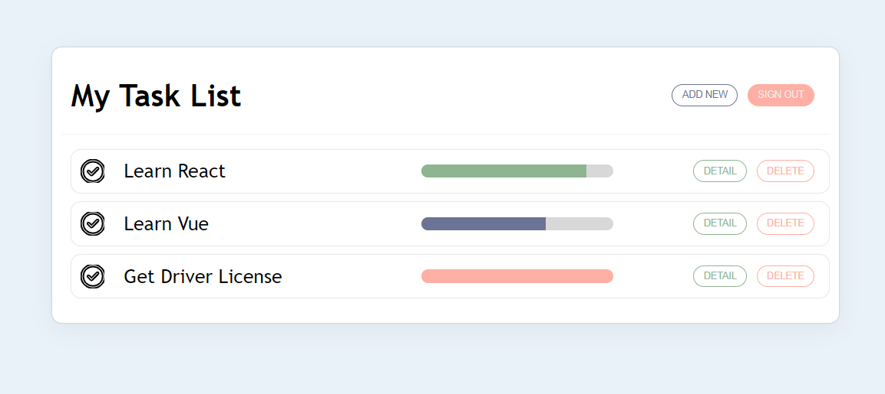
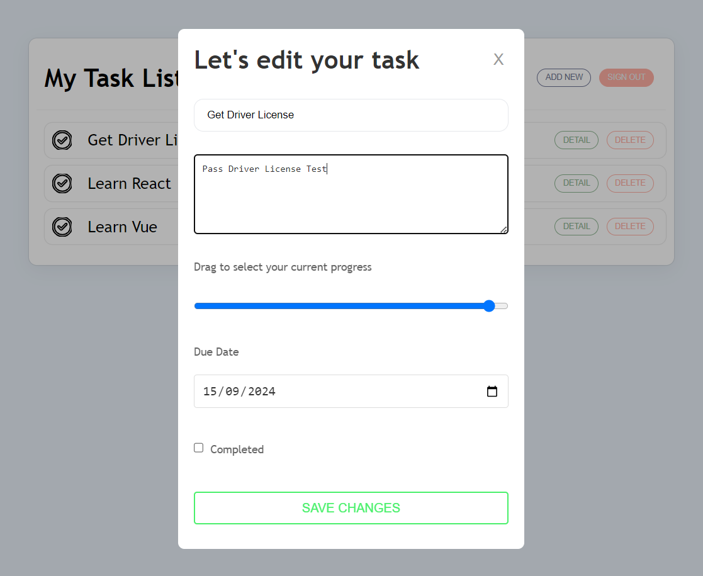

# TodoList App

## Description

The TodoList App is a simple application designed to help you manage your daily tasks. With a clean and intuitive interface, it allows you to add, edit, delete, and mark tasks as completed. It’s built to help you stay organized and boost your productivity.

## Images



## Key Features

- **User Signup and Login**: Create a personalize todo list
- **Add Tasks**: Create new tasks with clear descriptions.
- **Edit Tasks**: Modify details of existing tasks.
- **Delete Tasks**: Remove tasks that are completed or no longer needed.
- **Mark Tasks as Completed**: Track your progress by marking tasks as completed.

## Technologies

- **Frontend**: HTML, CSS, JavaScript
- **Backend**: Node.js, Express.js
- **Database**: Postgresql
- **Framework**: React.js

## Installation

1. **Clone the Repository**

   ```bash
   git clone https://github.com/johnathanjohnathan/Todo_Apps.git
   ```

2. **Install Dependencies**

   If using Node.js:

   ```bash
   npm install
   ```

   Or with `yarn`:

   ```bash
   yarn install
   ```

3. **Run the Application**

   ```bash
   npm start
   ```

   Or with `yarn`:

   ```bash
   yarn start
   ```

   The app will run at `http://localhost:3000` (or the port specified).

## Usage

1. **User Signup**: Click the "Signup" button to registrate your account.
2. **User Login**: Click the "Login" button to verify your account.
3. **Add Tasks**: Click the "Add Task" button and enter the task detail.
4. **Edit Tasks**: Click the edit icon to the task you want to change, then update the detail.
5. **Delete Tasks**: Click the delete icon to the task you want to remove.
6. **Mark Tasks as Completed**: Click the checkbox in the detail to mark it as completed.
